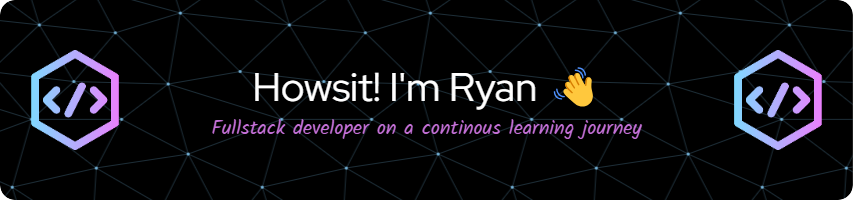

  

**<h3 align="left">A little bit about me:</h3>**

🏢 I'm a former Agile Coach and Scrum Master, but that doesn't mean I've lost the skills those roles taught me and still use them all the time.

🌱 I’m following my passion, learning to code, building exciting apps and really stretching my brain with problem solving and continuous learning.

📖 I've recently completed the <a href="https://schoolofcode.co.uk/">School of Code</a> bootcamp which has helped me discover an affinity for full-stack development, though my current strengths reside largely in Front-end and Back-end Development. I love seeing an app develop from the ground up, and having a hand in all aspects of it so I can learn more!

🧠 This is just the beginning of my learning journey, I'm not just embracing the struggle...I'm LOVING it! I'm so excited for whatever comes next!

🛝 In my non-coding, non-learning time I like to spend time with my wife and pooch, run, walk, cycle, kitesurf, game and all manner of other things.

**<h3 align="left">Rapid Fire</h3>**

- 💼 I'm currently working on: **A Learning Audit App using React and Node.js**
- 🌱 I'm currently learning: **More about Vanilla JavaScript(classes!)/TypeScript and React.js**
- 💡 On my hitlist to learn: **Python, AI Engineering**
- 💬 Ask me about: **My Projects, my prior experience or just anything you want, I'd love to chat!**

**<h3 align="left">I love to code with:</h3>**

 
 
 

 
 

**<h3 align="left">I have experience with:</h3>**

 
 
 
 
 
 
 

**<h3 align="left">GitHub Stats</h3>**

  

